# IMPLEMENTING A CLIENT SERVER ARCHITECTURE USING MYSQL DATABASE MANAGEMENT SYSTEM

## Configure a server for mysql server

Update Ubuntu

`sudo apt update`

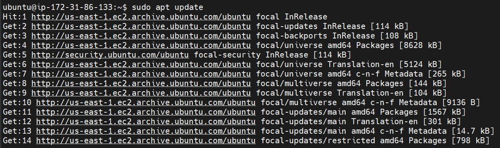

Upgrade Ubuntu

`sudo apt upgrade`

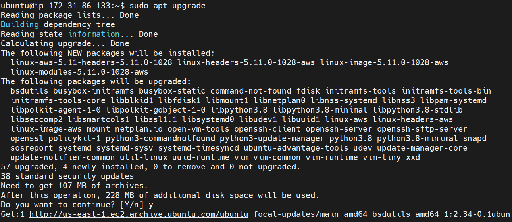

Install mysql server

`sudo apt install mysql-server`

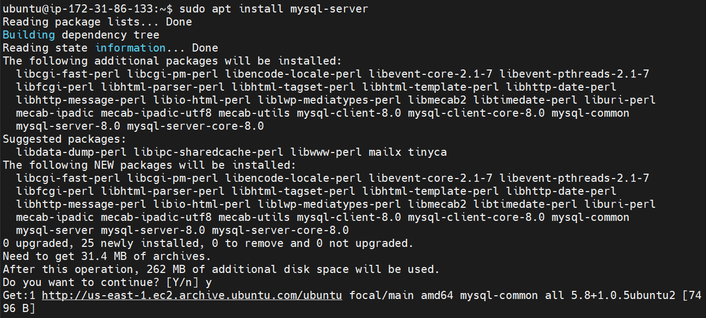

`sudo mysql_secure_installation`

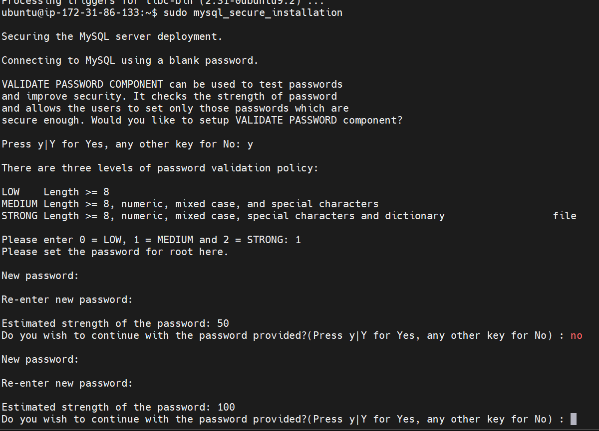

Switch to mysql console

`sudo mysql`

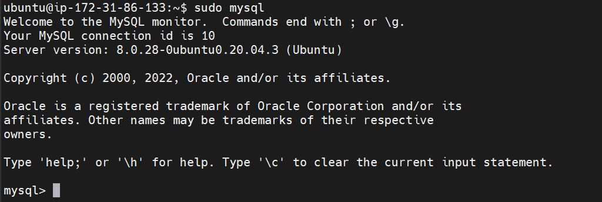

Create user in mysql

`mysql>  CREATE USER 'remote_user'@'%' IDENTIFIED WITH mysql_native_password BY 'Password12345.';`

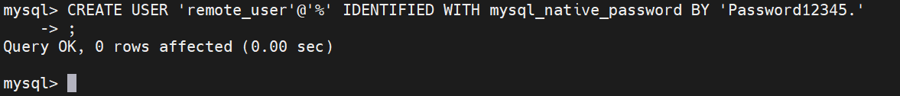

Create database

`mysql> CREATE DATABASE test_db;`

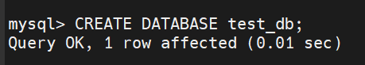

Grant sudo privileges

`mysql> GRANT ALL ON test_db.* TO 'remote_user'@'%' WITH GRANT OPTION;`

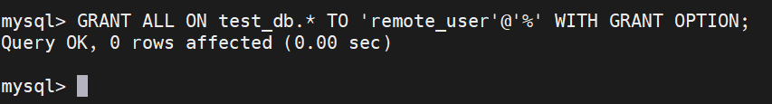

Flush privileges

`mysql> FLUSH PRIVILEGES`

## Change bind address 0.0.0.0

Open and edit mysqld.cnf file

`sudo vim /etc/mysql/mysql.conf.d/mysqld.cnf`

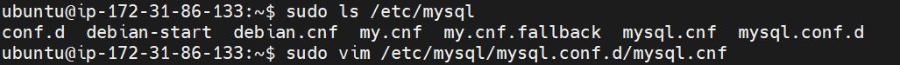

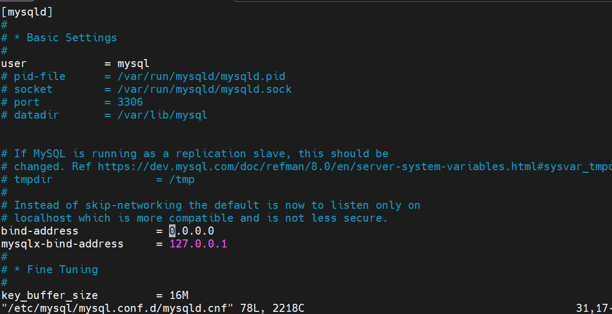

Restart mysql

`sudo systemctl restart mysql`

# CREATE CLIENT SERVER

Update Ubuntu 

`sudo apt update`

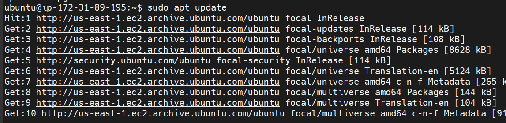

Upgrade Ubuntu

`sudo apt upgrade`

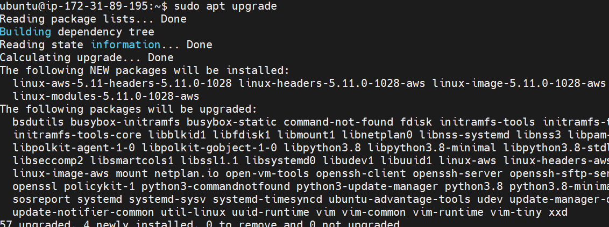

Install mysql-client

`sudo apt-get install mysql-client`

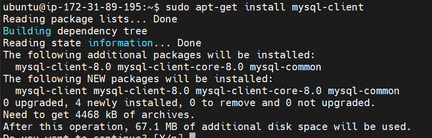

Get client server ip 

` ip addr show`

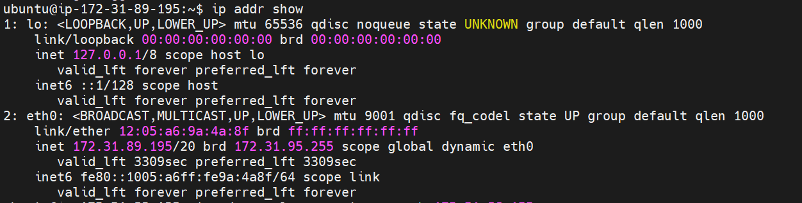

Add ip to ec2 inbound rules

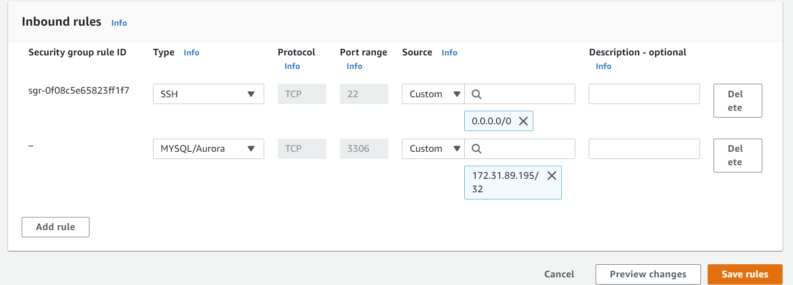

In client server connect to mysql

` sudo mysql -u remote_user -h 172.31.86.133 -p`

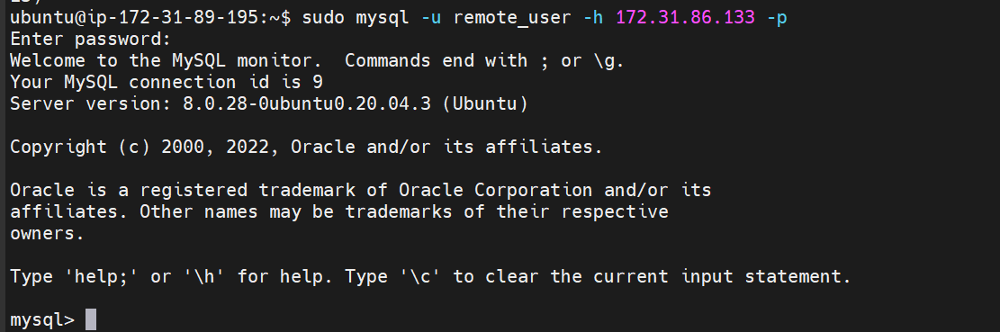

Test mysql connection

`mysql>Show databases;`

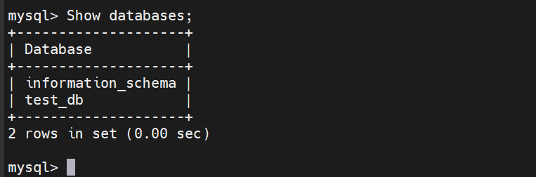
